# CV_PR3 — Deep Learning / Computer Vision Practical

A student-friendly Computer Vision and Deep Learning practical project covering **morphological image processing, bitwise operations, image histograms, YuNet face detection, YOLOv8n object detection, and an integrated real-time detection pipeline**.

---

## 📌 Project Overview

This project demonstrates both **classical image-processing techniques** and **deep-learning-based detection** using Python and OpenCV.

### Technologies Used

- Python
- OpenCV
- NumPy
- Matplotlib
- Pandas
- YuNet Face Detector
- YOLOv8n
- Jupyter Notebook / VS Code

---

# 📂 Project Structure

```text
PR-3/
│
├── CV_PR3.ipynb
├── requirements.txt
├── yolov8n.pt
│
├── data/
│   ├── images/
│   │   ├── face1.jpg
│   │   ├── face2.jpg
│   │   ├── face3.jpg
│   │   ├── fruits.png
│   │   ├── morphology.jpg
│   │   ├── objects1.jpg
│   │   └── objects2.jpg
│   │
│   └── models/
│       └── face_detection_yunet_2023mar.onnx
│
└── plots/
    ├── task1_binary.png
    ├── task1_kernel_comparison.png
    ├── task1_morphology_1x5.png
    ├── task2_before_after_histograms.png
    ├── task2_bgr_histogram.png
    ├── task2_bitwise_grid.png
    ├── task2_brightness_contrast.png
    ├── task2_grayscale_histogram.png
    ├── task2_masked_region.png
    ├── task3_face_blur.png
    ├── task3_threshold_experiment.png
    ├── task4_per_class_summary.png
    ├── task4_threshold_experiment.png
    ├── task4_yolo_static.png
    ├── task5_fps_comparison.png
    └── final_comparison.csv
```

---

# 🧪 Task 1 — Morphological Operations

Morphological image processing is applied to a binary image using a structuring element.

## Operations performed

### Erosion

Erosion shrinks the foreground region and can remove small unwanted white noise.

### Dilation

Dilation expands the foreground region and can connect nearby components or fill small gaps.

### Opening

Opening is:

```text
Erosion → Dilation
```

It is useful for removing small bright noise.

### Closing

Closing is:

```text
Dilation → Erosion
```

It is useful for filling small holes and gaps.

## Kernel Comparison

The project compares:

- RECT
- ELLIPSE
- CROSS

with:

- 3 × 3
- 5 × 5
- 9 × 9

### Result

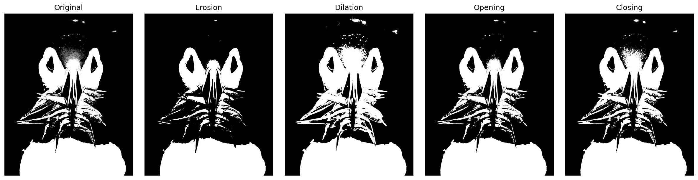

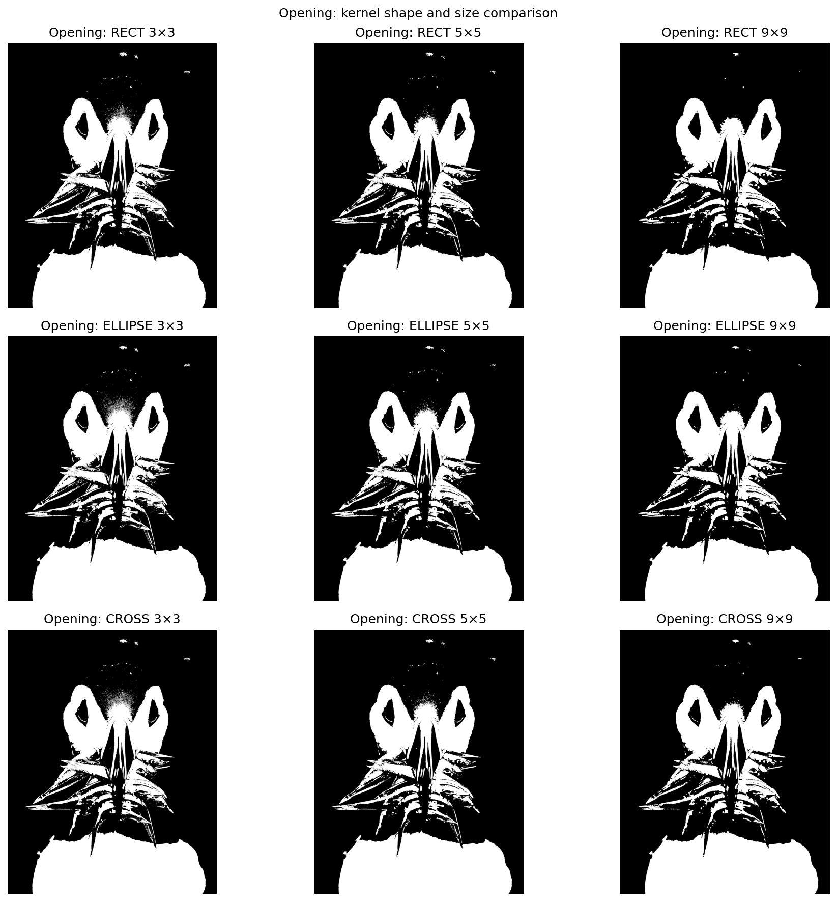

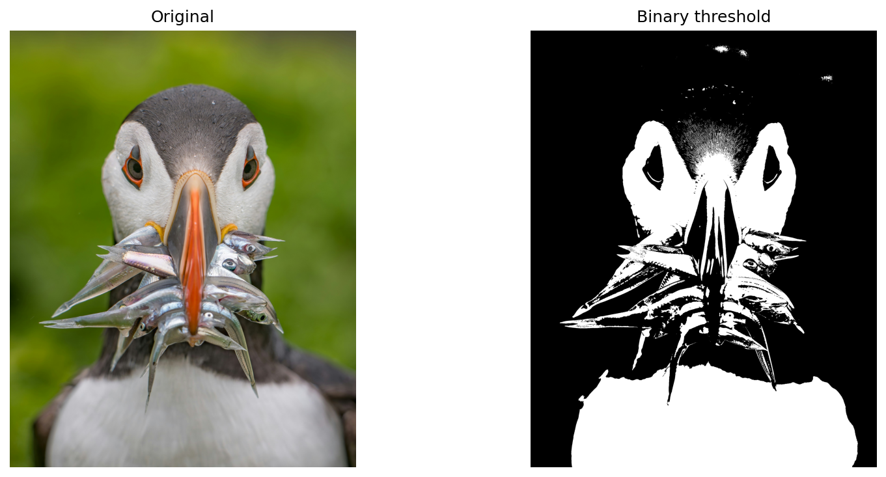

---

# 🔲 Task 2 — Bitwise Operations & Image Histograms

This task demonstrates logical operations on binary masks and histogram-based image analysis.

## Bitwise Operations

The following operations are implemented:

- AND
- OR
- XOR
- NOT

### Result

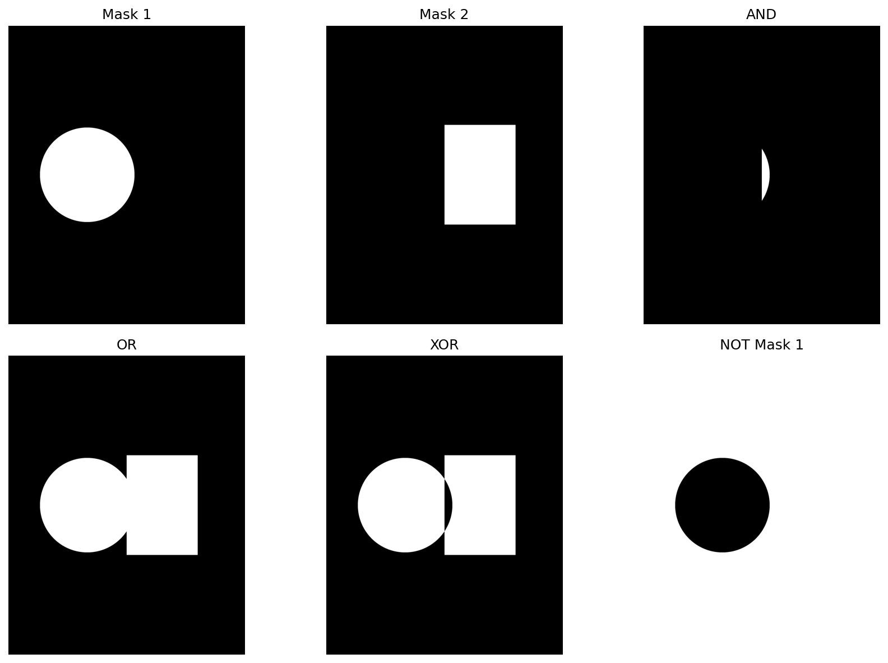

## Masked Region

A binary mask is applied to an image to extract a selected region of interest.

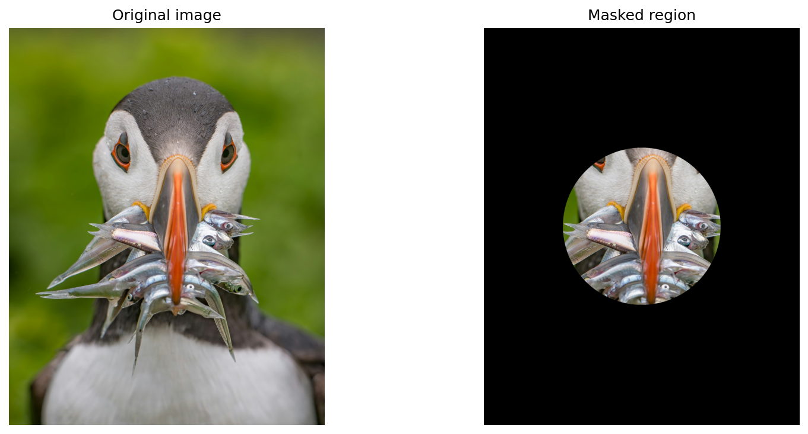

## Grayscale Histogram

The grayscale histogram shows the frequency of pixel intensity values from 0 to 255.

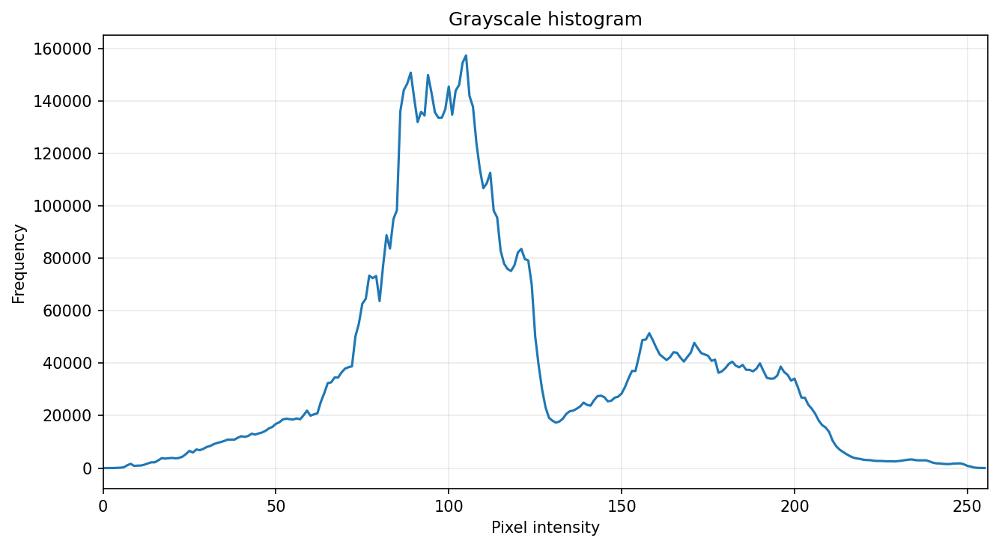

## B/G/R Histogram

The project also plots separate histograms for the:

- Blue channel
- Green channel
- Red channel

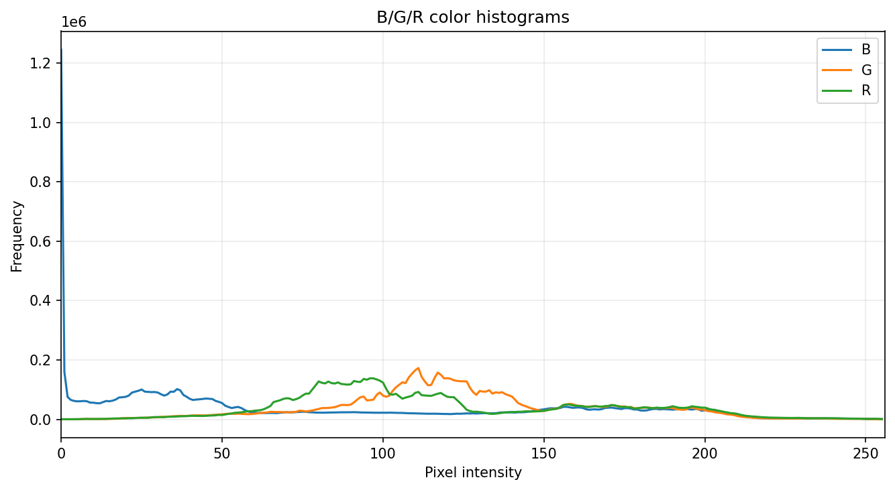

## Brightness and Contrast

The transformation used is:

```text
new_pixel = alpha × pixel + beta
```

- `alpha` controls contrast.
- `beta` controls brightness.

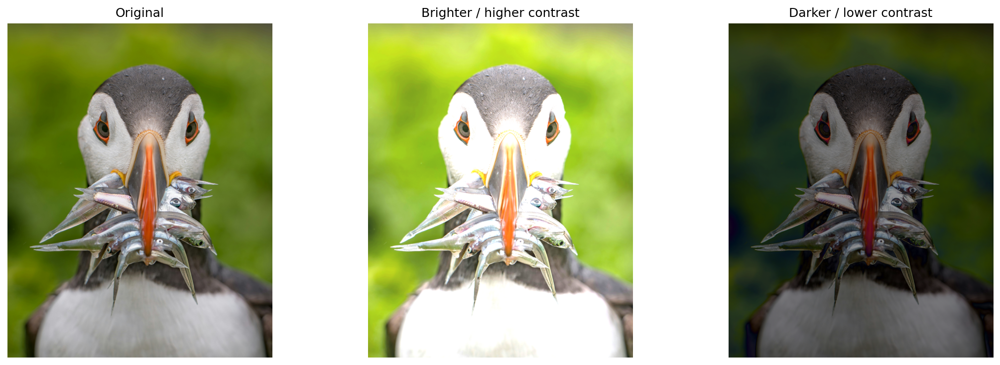

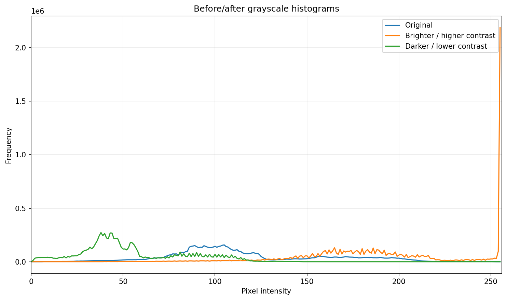

---

# 👤 Task 3 — Face Detection with YuNet

YuNet is used for face detection with OpenCV's `FaceDetectorYN` API.

The detector provides:

- Face bounding box
- Confidence score
- Five facial landmarks

## YuNet Model

The model file used is:

```text
data/models/face_detection_yunet_2023mar.onnx
```

## Static Face Detection

The project uses:

```text
face1.jpg
face2.jpg
face3.jpg
```

for static-image face detection.

The output contains bounding boxes, confidence scores and facial landmarks.

## Confidence Threshold Experiment

The following thresholds are tested:

```text
0.5
0.7
0.9
```

A lower threshold can accept more candidate detections, while a higher threshold requires greater confidence.

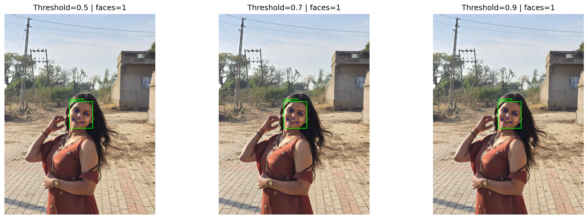

## Face Anonymisation

Detected face regions are blurred using Gaussian blur.

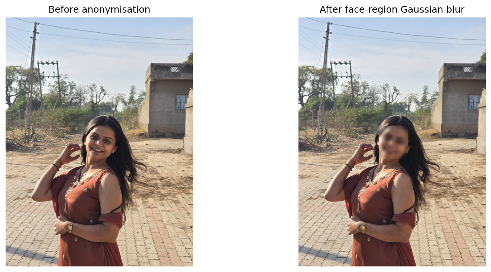

## Real-Time Face Detection

YuNet can also be used with a laptop webcam using:

```python
cv2.VideoCapture(0)
```

The real-time section displays:

- Face bounding boxes
- Five facial landmarks
- Confidence
- Number of detected faces
- FPS

Press **Q** to stop the webcam.

---

# 🎯 Task 4 — Object Detection with YOLOv8n

YOLOv8n is used for general object detection.

The project uses the pretrained:

```text
yolov8n.pt
```

## Static Object Detection

Object images:

```text
objects1.jpg
objects2.jpg
```

are processed using YOLOv8n.

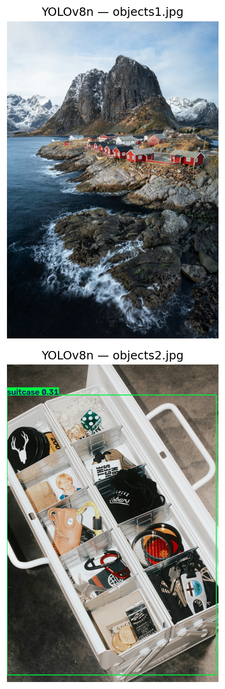

## Confidence and IoU Experiment

The project tests:

### Confidence

```text
0.25
0.50
0.75
```

### IoU

```text
0.30
0.50
0.70
```

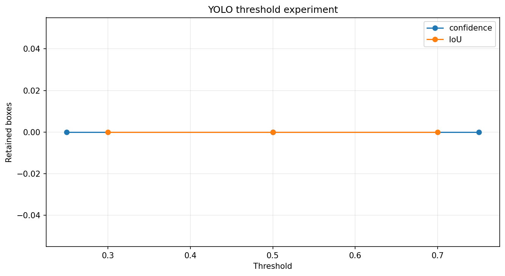

## Per-Class Detection Summary

Detected object classes are counted and displayed in a bar chart.

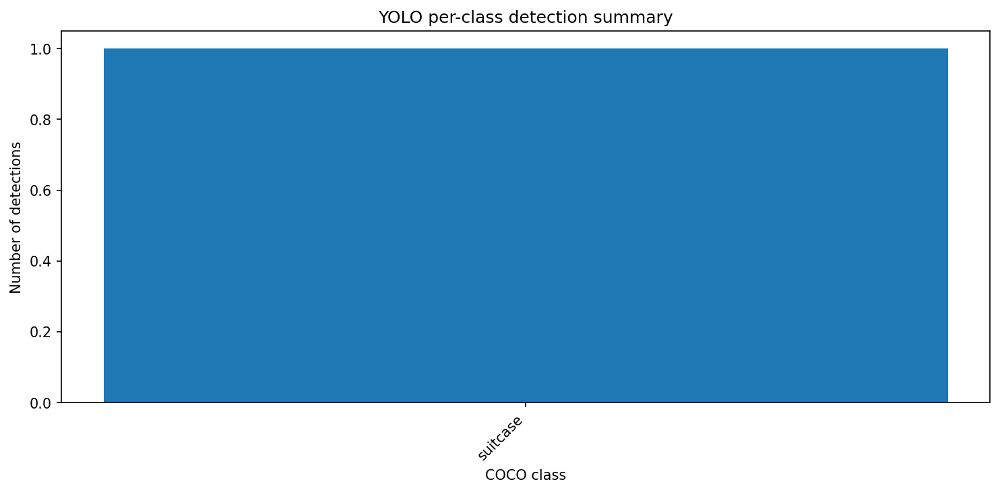

---

# 🎥 Task 5 — Integrated Real-Time Pipeline

The final pipeline combines:

```text
Laptop Webcam
      │
      ├──────────────► YuNet
      │                 │
      │                 └── Face Detection
      │
      └──────────────► YOLOv8n
                        │
                        └── Object Detection
```

The integrated system displays face and object detections in real time.

## FPS Benchmark

FPS is measured for:

- YuNet
- YOLOv8n
- Integrated YuNet + YOLOv8n

The actual FPS depends on the computer hardware, camera resolution and system load.

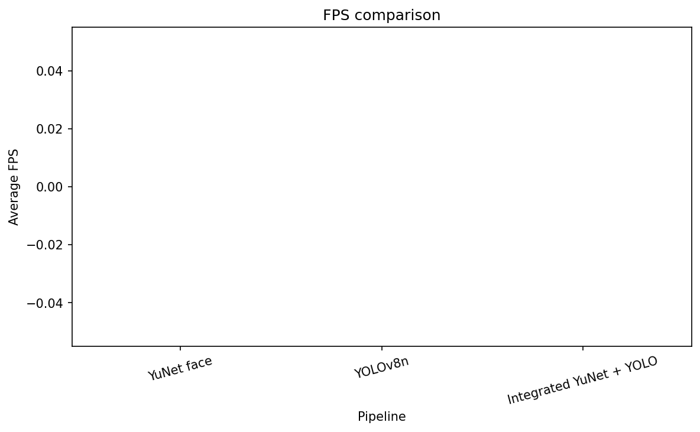

---

# 📊 Final Comparison

| Technique | Type | Main Purpose |
|---|---|---|
| Morphology | Classical CV | Noise removal and shape processing |
| Bitwise Operations | Classical CV | Masking and logical image operations |
| Histograms | Classical CV | Brightness/contrast analysis |
| YuNet | Deep Learning | Face detection + landmarks |
| YOLOv8n | Deep Learning | General object detection |
| YuNet + YOLOv8n | Integrated DL | Real-time face + object detection |

The detailed comparison is also available in:

```text
plots/final_comparison.csv
```

---

# 💡 Final Reflection

For a real-time monitoring system, a practical approach is to combine lightweight preprocessing with compact deep-learning models.

**YuNet** is suitable for face-focused detection because it is lightweight and provides facial landmarks.

**YOLOv8n** is suitable for general object detection because it can detect multiple object classes using a pretrained model.

For an edge device, the system can be optimised by:

- Reducing unnecessary image resolution
- Using lightweight models
- Tuning confidence thresholds
- Avoiding expensive preprocessing
- Measuring FPS on the actual target hardware

For a cloud/server deployment, a larger model can be considered when higher accuracy is more important than low computational cost.

---

# 🛠️ Installation

Create/activate your Python environment and install the dependencies:

```bash
python -m pip install -r requirements.txt
```

The main packages are:

```text
opencv-python
opencv-contrib-python
ultralytics
numpy
matplotlib
pandas
```

---

# ▶️ How to Run

### 1. Open the project

Open:

```text
CV_PR3.ipynb
```

in VS Code or Jupyter Notebook.

### 2. Check OpenCV

```python
import cv2

print(cv2.__version__)
print(hasattr(cv2, "FaceDetectorYN"))
```

The second line should return:

```text
True
```

### 3. Add images

Place the required images inside:

```text
data/images/
```

### 4. Run the notebook

Run the cells from top to bottom.

### 5. Webcam

For real-time detection, make sure your laptop camera is available.

If:

```python
cv2.VideoCapture(0)
```

does not open the camera, try:

```python
cv2.VideoCapture(1)
```

Press:

```text
Q
```

to close the webcam window.

---

# 📁 Output Files

The notebook saves generated plots inside:

```text
plots/
```

Examples:

```text
task1_morphology_1x5.png
task2_bitwise_grid.png
task2_grayscale_histogram.png
task3_threshold_experiment.png
task3_face_blur.png
task4_yolo_static.png
task4_per_class_summary.png
task5_fps_comparison.png
```

